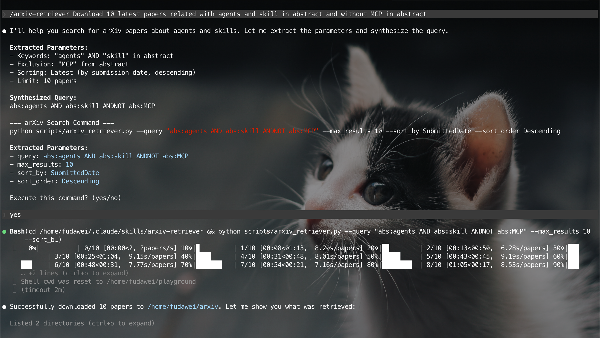

<div align="center">

# ariv-skills

[](LICENSE)
[](https://claude.ai/code)
[](https://agentskills.io)
[](https://skills.sh)

The skills for working with academic papers on arXiv.

</div>

---
- [ariv-skills](#ariv-skills)
  - [arxiv-retriever](#arxiv-retriever)
    - [Examples](#examples)
  - [pdf-parser](#pdf-parser)
    - [Examples](#examples-1)
  - [Installation](#installation)
    - [Using `skills.sh` (Recommended)](#using-skillssh-recommended)
    - [Manual Installation](#manual-installation)
  - [Typical Workflow](#typical-workflow)
  - [Acknowledgements](#acknowledgements)

---

## arxiv-retriever

Search and download papers from arXiv using natural language.



### Examples

**Download latest papers on a topic:**
```
Download 10 latest papers about quantum machine learning
```

**Download specific papers by ID:**
```
Download papers 1706.03762 and 1810.04805
```

**Search by author and topic:**
```
Find papers about attention by author Vaswani
```

---

## pdf-parser

Convert PDF papers to markdown using PaddleOCR.

### Examples

**Convert downloaded papers:**
```
Convert these PDFs to markdown: arxiv/*/*.pdf
```

**Convert papers in a directory:**
```
Parse all PDFs in ./papers/ to markdown
```

---

## Installation

### Using `skills.sh` (Recommended)

```bash
# Install arxiv-retriever skill
npx skills add https://github.com/PKUfudawei/arxiv-skills --skill arxiv-retriever

# Install pdf-parser skill
npx  skills add https://github.com/PKUfudawei/arxiv-skills --skill pdf-parser

# Install both skills
npx skills add https://github.com/PKUfudawei/arxiv-skills
```

### Manual Installation

```bash
git clone https://github.com/PKUfudawei/arxiv-skills.git
cp -r arxiv-skills/skills/* ~/.claude/skills/
```

---

## Typical Workflow

```
1. Ask Claude to download papers from arXiv
2. Convert the PDFs to markdown for reading
```

---

## Acknowledgements

- [anthropics/skills](https://github.com/anthropics/skills)
- [arXiv API](https://info.arxiv.org/help/api/index.html)
- [lukasschwab/arxiv.py](https://github.com/lukasschwab/arxiv.py)
- [nathangrigg/arxiv2bib](https://github.com/nathangrigg/arxiv2bib)
- [PaddlePaddle/PaddleOCR](https://github.com/PADDLEPADDLE/PADDLEOCR)
