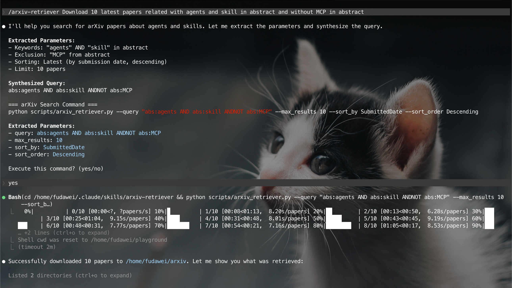

<div align="center">

# arXiv-skills

**Agent skills for reading academic papers on arXiv — search & download, then parse PDFs to Markdown.**

[English](./README.md) · [中文](./README.zh-CN.md)

[](LICENSE)
[](https://claude.ai/code)
[](https://agentskills.io)
[](https://skills.sh)

</div>

## Table of Contents

- [Skills](#skills)
- [Quick Start](#quick-start)
- [arxiv-retriever](#arxiv-retriever)
- [pdf-parser](#pdf-parser)
- [Typical Workflow](#typical-workflow)
- [Requirements](#requirements)
- [Acknowledgements](#acknowledgements)

## Skills

| Skill | What it does |
|-------|--------------|
| [arxiv-retriever](#arxiv-retriever) | Search and download arXiv papers (PDF, metadata and BibTeX) from natural-language requests |
| [pdf-parser](#pdf-parser) | Convert PDF papers to Markdown with images via the PaddleOCR API |

## Quick Start

The repo follows the [Agent Skills](https://agentskills.io) layout (`skills/<name>/SKILL.md`), so it works with [skills.sh](https://skills.sh) and can be installed with any coding agent:

```bash
# Install the arxiv-retriever skill
npx skills@latest add PKUfudawei/arxiv-skills --skill arxiv-retriever

# Install the pdf-parser skill
npx skills@latest add PKUfudawei/arxiv-skills --skill pdf-parser

# Install both (the installer lets you pick)
npx skills@latest add PKUfudawei/arxiv-skills
```

### Manual installation (Claude Code)

```bash
git clone https://github.com/PKUfudawei/arxiv-skills.git
cp -r arxiv-skills/skills/* ~/.claude/skills/
```

## arxiv-retriever

Search arXiv and download papers by extracting parameters from a natural-language request (IDs, keywords, authors, categories, date ranges). Each paper is saved as `<arxiv_id>.pdf` together with `meta.json` and `<arxiv_id>.bib`.

**Install this skill**

```bash
npx skills@latest add PKUfudawei/arxiv-skills --skill arxiv-retriever
```

**Then ask your coding agent:**

```
Download the 10 latest papers about quantum machine learning
Download papers 1706.03762 and 2305.12345
Find papers about attention by author Vaswani
```



Full usage: parameter extraction rules, query syntax and script arguments are in [skills/arxiv-retriever/SKILL.md](skills/arxiv-retriever/SKILL.md).

## pdf-parser

Convert downloaded PDF papers to Markdown (reading-order text plus extracted images) using the PaddleOCR-VL cloud API. Needs a `PADDLE_TOKEN`; see the skill guide.

**Install this skill**

```bash
npx skills@latest add PKUfudawei/arxiv-skills --skill pdf-parser
```

**Then ask your coding agent:**

```
Convert these PDFs to markdown: arxiv/*/*.pdf
Parse all PDFs in ./papers/ to markdown
```

Full usage: API setup, output format and error handling are in [skills/pdf-parser/SKILL.md](skills/pdf-parser/SKILL.md).

## Typical Workflow

```
1. Ask your agent to download papers from arXiv (arxiv-retriever)
2. Convert the downloaded PDFs to Markdown for reading (pdf-parser)
```

## Requirements

- Python 3.9+
- arxiv-retriever: `pip install arxiv arxiv2bib requests tqdm`
- pdf-parser: `pip install requests tqdm python-dotenv`, plus a PaddleOCR AI Studio API token

## Acknowledgements

- [anthropics/skills](https://github.com/anthropics/skills)
- [arXiv API](https://info.arxiv.org/help/api/index.html)
- [lukasschwab/arxiv.py](https://github.com/lukasschwab/arxiv.py)
- [nathangrigg/arxiv2bib](https://github.com/nathangrigg/arxiv2bib)
- [PaddlePaddle/PaddleOCR](https://github.com/PADDLEPADDLE/PADDLEOCR)
